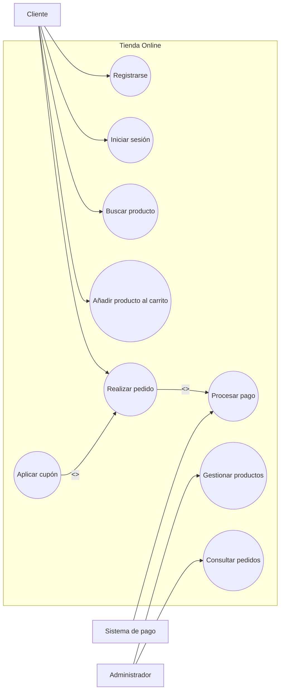

# UML

## Diagrama de casos de uso

### Objetivo

El **diagrama de casos de uso** es un diagrama UML que representa el **comportamiento funcional de un sistema** desde el punto de vista de los actores que interactúan con él.

Sirve para mostrar:

* Qué funcionalidades ofrece el sistema.
* Qué actores interactúan con esas funcionalidades.
* Qué relación existe entre los actores y los casos de uso.
* Cuál es el alcance general del sistema.

No muestra cómo está programado internamente el sistema, sino **qué hace el sistema**.

---

## Idea principal

Un diagrama de casos de uso responde a esta pregunta:

> ¿Qué puede hacer un actor con el sistema?

Ejemplo:

En una tienda online, un cliente puede:

* Registrarse.
* Iniciar sesión.
* Buscar productos.
* Añadir productos al carrito.
* Realizar pedidos.
* Pagar compras.

---

## Elementos principales

### 1. Actor

Un **actor** es una entidad externa que interactúa con el sistema.

Puede ser:

* Una persona.
* Otro sistema.
* Un dispositivo.
* Una organización externa.

Ejemplos:

* Cliente.
* Administrador.
* Sistema de pago.
* Servicio de correo.
* API externa.

Importante:

> El actor está fuera del sistema, pero se comunica con él.

---

### 2. Caso de uso

Un **caso de uso** representa una funcionalidad que ofrece el sistema.

Normalmente se escribe como una acción.

Ejemplos correctos:

* Registrar usuario.
* Iniciar sesión.
* Crear pedido.
* Consultar factura.
* Cancelar reserva.

Ejemplos incorrectos:

* Usuario.
* Pedido.
* Base de datos.
* Pantalla login.
* UsuarioController.

Un caso de uso debe representar **una acción funcional**, no una clase, una tabla o una pantalla.

---

### 3. Límite del sistema

El **límite del sistema** indica qué funcionalidades pertenecen al sistema que estamos modelando.

Los casos de uso van dentro del sistema.

Los actores quedan fuera.

Ejemplo conceptual:

```text
Actor externo → Sistema → Casos de uso
```

---

### 4. Asociación

La **asociación** indica que un actor participa en un caso de uso.

Ejemplo:

```text
Cliente → Realizar pedido
```

Significa que el actor `Cliente` puede ejecutar la funcionalidad `Realizar pedido`.

---

## Relaciones entre casos de uso

Las relaciones más importantes son:

* `<<include>>`
* `<<extend>>`
* Generalización

---

## Relación `<<include>>`

La relación `<<include>>` indica que un caso de uso **siempre necesita ejecutar otro caso de uso**.

Se usa cuando una funcionalidad es obligatoria dentro de otra.

Ejemplo:

```text
Realizar pedido → Procesar pago
```

Con `include` significa:

> Para realizar un pedido, siempre hay que procesar el pago.

### Cuándo usar `include`

Usa `<<include>>` cuando:

* Una funcionalidad siempre depende de otra.
* Hay comportamiento común obligatorio.
* Quieres reutilizar una acción que se repite en varios casos de uso.

Ejemplos:

* Comprar producto incluye procesar pago.
* Crear cuenta incluye validar email.
* Reservar cita incluye comprobar disponibilidad.

---

## Relación `<<extend>>`

La relación `<<extend>>` indica que un caso de uso añade comportamiento **opcional o condicionado** a otro caso de uso.

Ejemplo:

```text
Aplicar cupón → Realizar pedido
```

Con `extend` significa:

> El cliente puede aplicar un cupón, pero no siempre ocurre.

### Cuándo usar `extend`

Usa `<<extend>>` cuando:

* La funcionalidad es opcional.
* Depende de una condición.
* Añade comportamiento extra a un caso de uso base.

Ejemplos:

* Aplicar cupón extiende realizar pedido.
* Recuperar contraseña extiende iniciar sesión.
* Añadir seguro extra extiende reservar viaje.

---

## Diferencia entre `include` y `extend`

| Relación      | Significado                                  | Obligatorio | Ejemplo                                            |
| ------------- | -------------------------------------------- | ----------: | -------------------------------------------------- |
| `<<include>>` | Un caso de uso siempre usa otro              |          Sí | Realizar pedido incluye procesar pago              |
| `<<extend>>`  | Un caso de uso añade comportamiento opcional |          No | Realizar pedido puede extenderse con aplicar cupón |

Resumen:

```text
include = siempre ocurre
extend = puede ocurrir
```

---

## Generalización

La **generalización** representa una relación de herencia o especialización.

Puede aplicarse a actores o a casos de uso.

### Generalización entre actores

Ejemplo:

```text
Usuario
├── Cliente
└── Administrador
```

Esto significa que `Cliente` y `Administrador` son tipos específicos de `Usuario`.

### Generalización entre casos de uso

Ejemplo:

```text
Realizar pago
├── Pagar con tarjeta
└── Pagar con PayPal
```

Esto significa que existen diferentes formas de realizar un pago.

---

## Ejemplo completo: tienda online

### Actores

* Cliente.
* Administrador.
* Sistema de pago.

### Casos de uso

* Registrarse.
* Iniciar sesión.
* Buscar producto.
* Añadir producto al carrito.
* Realizar pedido.
* Procesar pago.
* Aplicar cupón.
* Gestionar productos.
* Consultar pedidos.

---

## Diagrama compatible con GitHub

GitHub renderiza diagramas Mermaid dentro de Markdown.



---

## Descripción textual de un caso de uso

El diagrama puede complementarse con una tabla que describa cada caso de uso.

### Caso de uso: Realizar pedido

| Campo             | Descripción                                                                                      |
| ----------------- | ------------------------------------------------------------------------------------------------ |
| Nombre            | Realizar pedido                                                                                  |
| Actor principal   | Cliente                                                                                          |
| Objetivo          | Permitir al cliente comprar los productos añadidos al carrito                                    |
| Precondición      | El cliente debe haber iniciado sesión                                                            |
| Flujo principal   | El cliente revisa el carrito, confirma dirección, selecciona método de pago y confirma el pedido |
| Flujo alternativo | Si el pago falla, el sistema muestra un error y permite intentarlo de nuevo                      |
| Postcondición     | El pedido queda registrado en el sistema                                                         |

---

## Buenas prácticas

### 1. Usar nombres claros

Correcto:

* Crear reserva.
* Cancelar pedido.
* Consultar historial.
* Actualizar perfil.

Incorrecto:

* Reserva.
* Pedido.
* Historial.
* Perfil.

Los casos de uso deben representar acciones.

---

### 2. No añadir detalles técnicos

Un diagrama de casos de uso no debería incluir:

* Tablas de base de datos.
* Controladores.
* Servicios internos.
* Repositorios.
* Clases Java.
* Métodos concretos.
* Consultas SQL.

Incorrecto:

* Guardar en tabla usuarios.
* Ejecutar query SQL.
* Llamar a UsuarioController.
* Insertar pedido en base de datos.

Correcto:

* Registrar usuario.
* Consultar perfil.
* Crear pedido.
* Actualizar datos personales.

---

### 3. Mantener el diagrama simple

Si el sistema es grande, es mejor dividirlo por módulos.

Ejemplo:

* Casos de uso de autenticación.
* Casos de uso de pedidos.
* Casos de uso de administración.
* Casos de uso de facturación.

---

## Errores comunes

### Confundir casos de uso con pantallas

Incorrecto:

* Pantalla login.
* Pantalla carrito.
* Pantalla administración.

Correcto:

* Iniciar sesión.
* Gestionar carrito.
* Administrar usuarios.

---

### Confundir actores con clases del código

Incorrecto:

* UserEntity.
* PedidoService.
* ClienteRepository.

Correcto:

* Cliente.
* Administrador.
* Sistema externo de pago.

---

### Usar `include` y `extend` al revés

Recuerda:

```text
include = obligatorio
extend = opcional
```

Ejemplo correcto:

```text
Realizar pedido --include--> Procesar pago
Aplicar cupón --extend--> Realizar pedido
```

---

## Diferencia con otros diagramas UML

| Diagrama UML | Qué representa                                                  |
| ------------ | --------------------------------------------------------------- |
| Casos de uso | Qué funcionalidades ofrece el sistema y quién las usa           |
| Clases       | Estructura del sistema: clases, atributos, métodos y relaciones |
| Secuencia    | Comunicación entre objetos a lo largo del tiempo                |
| Actividad    | Flujo de acciones o procesos                                    |
| Estados      | Estados por los que pasa un objeto o entidad                    |

---

## Resumen final

El **diagrama de casos de uso** muestra las funcionalidades principales de un sistema y los actores externos que interactúan con ellas.

Sus elementos principales son:

* Actores.
* Casos de uso.
* Límite del sistema.
* Asociaciones.
* Relaciones `include`, `extend` y generalización.

Idea clave:

```text
Un diagrama de casos de uso explica qué hace el sistema y quién lo usa.
No explica cómo está construido internamente.
```
